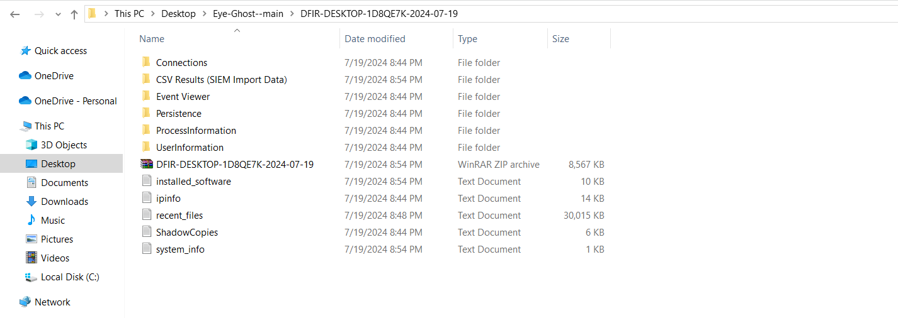

# GHOST EYE - Advanced investigator Tool
 
## Introduction

welcome to Ghost Eye is designed for system administrators and cybersecurity professionals to monitor and investigate system events, manage registry changes, and send notifications. The tool includes various scripts and modules to gather system information, track specific events, send alerts via Telegram, and convert investigation results into CSV files for easy analysis. it collects and processes various system data useful for digital forensics and incident response (DFIR).

## Features
 Ghost Eye is equipped to detect a wide array of aims, including but not limited to:
 
- **Detect Active Scan**
   - Detect active scan that occured on Network with alertion such as src & dest ip and dest port and  count
- **Real-time Registry Monitoring**
  - monitoring registry keys for changes and send alerts when modifications are detecte
  - Sends alerts to your Telegram bot when changes are detected.
  - Sends a notification if no changes are detected within a specified time.
- **Event-Based Monitoring**
   -Monitors Windows Event Log for specific security-related events such as successful logins, admin logins, new process creations, and PowerShell script executions.
- **Track Security Event Logs**
   - Event ID 4624: Successful logons.
   - Event ID 4672: Special privileges assigned to new logons (administrative logons).
   - Event ID 4688: New process creation.
  
- **System Investigation**
   - **Network Information**
      - Get-IPInfo: Retrieves information about the system's IP configuration.
      - Get-OpenConnections: Lists currently open network connections.
      - Get-NetworkShares: Retrieves information about network shares.
      - Get-SMBShares: Retrieves details about SMB shares.
      - Get-OfficeConnections: Lists connections to Office services.
      - Get-RDPSessions: Lists active Remote Desktop sessions.
      - Get-RemotelyOpenedFiles: Lists files opened remotely.
      - Get-DNSCache: Retrieves the DNS cache
   - **System Information**
      - Get-ShadowCopies: Lists shadow copies on the system.
      - Get-AutoRunInfo: Retrieves autorun information.
      - Get-InstalledDrivers: Lists installed drivers.
      - Get-ActiveUsers: Lists currently active users.
      - Get-LocalUsers: Lists all local users on the system.
      - Get-ActiveProcesses: Lists active processes.
      - Get-SecurityEventCount: Counts security events.
      - Get-SecurityEvents: Retrieves security events.
      - Get-EventViewerFiles: Lists files related to Event Viewer.
      - Get-RecentlyInstalledSoftwareEventLogs: Retrieves logs of recently installed software.
      - Get-RunningServices: Lists running services.
      - Get-ScheduledTasks: Lists scheduled tasks.
      - Get-ScheduledTasksRunInfo: Retrieves run information for scheduled tasks.
      - Get-ConnectedDevices: Lists connected devices.
      - Get-ChromiumFiles: Lists files related to Chromium-based browsers.
      - Get-RecentFiles: Lists recently modified files.
      - Get-InstalledSoftware: Lists all installed software on the system.
      - Get-SystemInfo: Collects detailed system information.
   - **PowerShell History**
      - Get-PowershellHistoryCurrentUser: Retrieves PowerShell history for the current user.
      - Get-PowershellConsoleHistory-AllUsers: Retrieves PowerShell console history for all users.
   - **Data Collection for SIEM**
      - Collects various system and security-related data, exporting it to CSV format for easy import into Security Information and Event Management (SIEM) systems.
      
- **Track PowerShell Events**
   - Event ID 4103: Module logging (PowerShell script module logging).
   - Event ID 4104: Script block logging (PowerShell script execution).
     
- **Alerting**
 - **Telegram Notifications:**
   - Real-time alerts for specified events sent to a Telegram chat.
   - Customizable messages include relevant details about each event.
   
- **Error Handling**
  - The script includes error handling to log and report any issues that occur during event tracking and processing.

## Prerequisites
- A Telegram bot token and chat ID to receive alerts. Follow the instructions here to create a bot and obtain the botToken and chatID
  
- Then Replace your bot token and chat ID within the Config.ps1 file

  ## Create a Telegram Bot
- Open Telegram and search for BotFather. This is the official bot for creating and managing Telegram bots.
- Start a chat with BotFather and send the command /start
- end the command /newbot to create a new bot.
- Follow the instructions provided by BotFather to choose a name and username for your bot. The username must end with "bot" (e.g., MyAwesomeBot).
- BotFather will then provide you with a bot token. This token is used to authenticate your bot with the Telegram API.
   - **Obtain Your Chat ID**
   - Send a message in the yourbot chat to initiate the interaction with the bot.
   - Use the following URL to get updates from the bot
     ```sh
     https://api.telegram.org/bot<YourBotToken>/getUpdates
     ```
     - Replace <YourBotToken> with the token provided by BotFather.
     - Open the URL in your web browser. You should see a JSON response containing details about the recent messages. Look for the chat object within the message array, which contains the id field. This id is your            chat ID
     - Using the Bot Token and Chat ID
     - Bot Token: This is used in the API requests to authenticate your bot.
     - Chat ID: This is used to specify the target chat (group or individual) where messages will be sent.
## configuration
```sh
#shensure that path is defined in your windows for firewall log  
$logFile = "C:\Windows\System32\LogFiles\Firewall\pfirewall.log"

# replace the botToken & chatID  with yours
$botToken = ""
$chatID = ""
```
## OUTPUT


## Telegrm Dashboard


## Installation
Get started with Ghost Eye by following these steps:
```sh
git clone https://github.com/0Xdarkday/Ghost-Eye.git
cd Ghost-Eye
```
## Example usages
  ```sh
./ghots-eye.ps1
  ______   __                              __            ________                    
 /      \ |  \                            |  \          |        \                   
|  $$$$$$\| $$____    ______    _______  _| $$_         | $$$$$$$$__    __   ______  
| $$ __\$$| $$    \  /      \  /       \|   $$ \ ______ | $$__   |  \  |  \ /      \ 
| $$|    \| $$$$$$$\|  $$$$$$\|  $$$$$$$ \$$$$$$|      \| $$  \  | $$  | $$|  $$$$$$\
| $$ \$$$$| $$  | $$| $$  | $$ \$$    \   | $$ __\$$$$$$| $$$$$  | $$  | $$| $$    $$
| $$__| $$| $$  | $$| $$__/ $$ _\$$$$$$\  | $$|  \      | $$_____| $$__/ $$| $$$$$$$$
 \$$    $$| $$  | $$ \$$    $$|       $$   \$$  $$      | $$     \\$$    $$ \$$     \
  \$$$$$$  \$$   \$$  \$$$$$$  \$$$$$$$     \$$$$        \$$$$$$$$_\$$$$$$$  \$$$$$$$
                                                                 |  \__| $$          
                                                                  \$$    $$          
                                                                   \$$$$$$   
                                        Made by Mahmoud Shaker
                                      Welcome to Ghost-Eye investigator   
   
